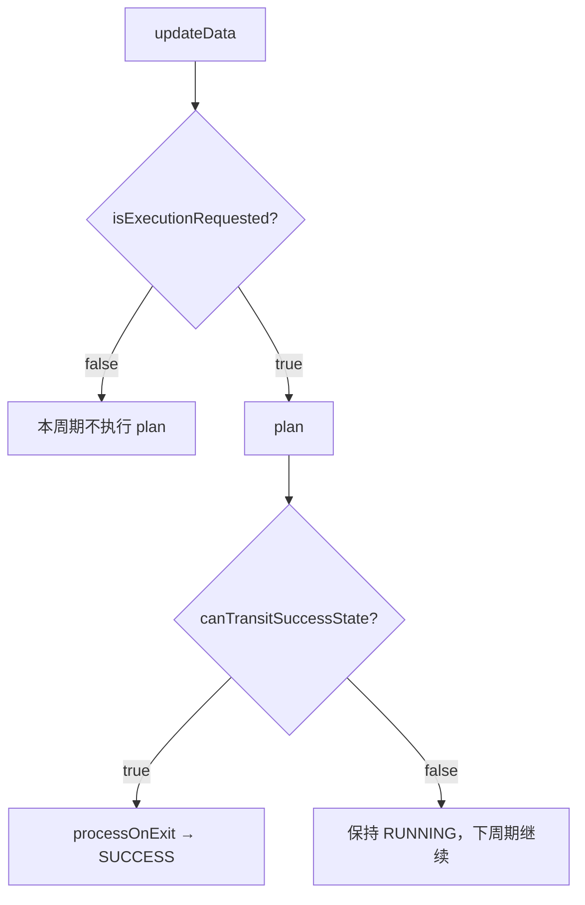
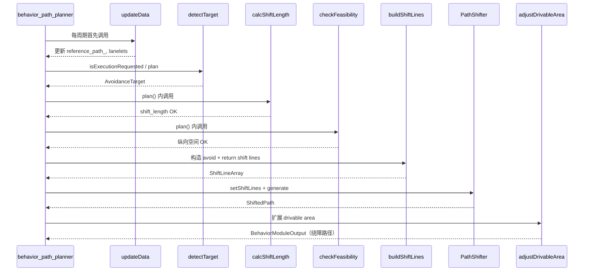

# Simple Avoidance 模块执行流程总结

本文档按 **从进入函数到退出函数** 的顺序，对照源码说明 `autoware_behavior_path_simple_avoidance_module` 的完整执行链路。

---

## 1. 模块在系统中的位置

```
behavior_path_planner 主节点（每周期）
  └─ SceneModuleManager（slot2: simple_avoidance）
       └─ SimpleAvoidanceModuleManager::createNewSceneModuleInstance()
            └─ SimpleAvoidanceModule（SceneModuleInterface 子类）
```

| 文件 | 职责 |
|------|------|
| `manager.hpp/cpp` | 插件注册、参数加载、创建模块实例 |
| `scene.hpp/cpp` | 核心逻辑：数据更新、目标检测、路径规划 |
| `utils.cpp` | 偏移量计算、可行性检查、路径姿态补全 |
| `data_structs.hpp` | 参数、目标、诊断、失败原因等数据结构 |

---

## 2. 生命周期：模块何时进入 / 退出

### 2.1 插件加载（进程启动，一次）

```
SimpleAvoidanceModuleManager::init(node)
  ├─ initInterface(node, {})
  └─ declare_parameter("simple_avoidance.*") → SimpleAvoidanceParameters
```

**退出**：无显式退出，参数对象保存在 `parameters_` 中供所有实例共享。

### 2.2 模块实例创建（Manager 首次需要时）

```
SimpleAvoidanceModuleManager::createNewSceneModuleInstance()
  └─ new SimpleAvoidanceModule(name_, node_, parameters_, ...)
       └─ SceneModuleInterface 基类构造（RTC、marker、planning_factor 等）
```

**退出**：实例由 behavior_path_planner 框架管理，模块失效时销毁。

### 2.3 模块被批准运行（APPROVED）

```
processOnEntry()    // 当前为空实现，无操作
setInitState()      // 返回 ModuleStatus::RUNNING
```

### 2.4 模块结束运行（SUCCESS / 被替换）

```
canTransitSuccessState() == true 时框架将状态切为 SUCCESS
processOnExit()
  └─ initVariables()   // 清空所有运行时状态
```

### 2.5 `initVariables()` 重置内容

| 成员变量 | 重置为 |
|----------|--------|
| `reference_path_` | 空路径 |
| `current_lanelets_` | 空 |
| `path_shifter_` | 默认 PathShifter |
| `prev_output_` | 空 ShiftedPath |
| `active_target_` | nullopt |
| `debug_data_` | 默认 |
| path candidate / reference | `resetPathCandidate()` / `resetPathReference()` |

---

## 3. 每规划周期主流程（核心）

behavior_path_planner 对每个 **APPROVED** 模块大致按以下顺序调用：



另有并行调用 `planCandidate()`（供 RTC/可视化候选路径，本模块无 RTC）。

---

## 4. `updateData()` — 数据准备阶段

**文件**：`scene.cpp:295`

**入口条件**：上游 `getPreviousModuleOutput().path` 至少 2 个点。

**流程**：

```
updateData()
│
├─ [guard] path.points < 2 → 直接 return（本周期 reference_path_ 不更新）
│
├─ extendBackwardLength(上游 path)
│    └─ 向后拼接历史路径，保证 PathShifter 有足够后方长度
│
├─ utils::resamplePathWithSpline(..., 1.0m) → reference_path_
│
├─ path_shifter_.setPath(reference_path_)
│
├─ route_handler->getClosestLaneletWithinRoute(ego_pose)
│    └─ getLaneletSequence(...) → current_lanelets_
│
└─ path_shifter_.removeBehindShiftLineAndSetBaseOffset(ego_idx)
     └─ 清除自车后方过期 shift line，设置 base offset
```

**退出**：无返回值；更新成员变量供 `detectTarget()` / `plan()` 使用。

### 4.1 `extendBackwardLength()` 详解

**目的**：绕障 shift line 可能落在自车后方，需要比默认 `backward_path_length` 更长的参考线。

```
1. 计算已有 shift line 起点到自车的最大距离 longest_dist
2. backward_length = max(planner.backward_path_length, longest_dist + 10m)
3. 从上游历史 path 截取后方点 + 当前 path 自车前方点 → 拼接
```

---

## 5. `isExecutionRequested()` — 是否请求执行

**文件**：`scene.cpp:267`

```
isExecutionRequested()
│
├─ getCurrentStatus() == RUNNING → return true（已在运行，保持执行）
│
├─ detectTarget().has_value() → return true（有绕障目标，请求执行）
│
└─ diagnoseNoTarget() + logNoTargetDiagnosisDetails("not requested (module idle)")
     └─ return false
```

**日志**：模块 idle 时打印 `not requested`，含各过滤原因统计。

---

## 6. `detectTarget()` — 目标检测（核心过滤链）

**文件**：`scene.cpp:320`

**输出**：`std::optional<AvoidanceTarget>`，多个候选时取 **纵向最近** 的一个。

```
detectTarget()
│
├─ [guard] 无 dynamic_object 或 reference_path 为空 → nullopt
│
└─ for each object in planner_data_->dynamic_object->objects:
     │
     ├─ ① 速度过滤
     │    speed = hypot(vx, vy)
     │    speed >= th_moving_speed → continue（运动物体忽略）
     │
     ├─ ② 车道过滤
     │    isObjectOverlappingLanelets(object, current_lanelets_)
     │    └─ 物体 polygon 与 route lanelet 无重叠 → continue
     │
     ├─ ③ 纵向距离过滤
     │    longitudinal_distance = calcSignedArcLength(ref_path, ego, object)
     │    不在 [min_forward_distance, max_forward_distance] → continue
     │
     ├─ ④ 横向重叠过滤（是否需要绕）
     │    lateral_offset = calcLateralOffset(ref_path, object)
     │    overlap = |lateral_offset| - object_half_width
     │    overlap >= ego_half_width + lateral_margin → continue（离路径太远）
     │
     └─ ⑤ 取纵向最近 → AvoidanceTarget
          { pose, lon, lat, obj_hw, obj_hl, uuid }
```

### 6.1 匿名命名空间辅助函数

| 函数 | 作用 |
|------|------|
| `getObjectHalfWidth(shape)` | BOUNDING_BOX: dim.y/2；CYLINDER: dim.x/2 |
| `getObjectHalfLength(shape)` | BOUNDING_BOX/CYLINDER: dim.x/2 |
| `isObjectOverlappingLanelets()` | 调用 `path_safety_checker::isPolygonOverlapLanelet` |

---

## 7. `diagnoseNoTarget()` — 无目标诊断（仅日志）

**文件**：`scene.cpp:379`

与 `detectTarget()` 使用相同过滤逻辑，但 **不提前 continue**，而是统计每类拒绝数量，供 `logNoTargetDiagnosisDetails()` 输出。

**前置条件检查**（直接 return）：

| precondition | 含义 |
|--------------|------|
| `NO_DYNAMIC_OBJECT` | 感知话题无数据 |
| `EMPTY_REFERENCE_PATH` | reference_path_ 为空 |
| `EMPTY_CURRENT_LANELETS` | 无法获取当前 route lanelet |

**拒绝原因**（按优先级链式判定）：

1. `MOVING` — 速度过快
2. `OUT_OF_LANE` — polygon 不在 current_lanelets_
3. `LONGITUDINAL` — 纵向距离超范围
4. `NO_OVERLAP` — 横向无重叠，不需绕障

---

## 8. `plan()` — 主规划函数（进入 → 退出全路径）

**文件**：`scene.cpp:555`

这是模块最核心的函数，所有绕障逻辑在此完成。

```
plan()
│
├─ [Step 0] 初始化 PassThroughDebugInfo
│
├─ [Step 1] reference_path_.points < 2
│    └─ passThrough(NO_TARGET) ──────────────────────────► 退出①
│
├─ [Step 2] target = detectTarget()
│    │
│    ├─ 无 target：
│    │    ├─ active_target_.reset()
│    │    ├─ 若 path_shifter_ 仍有 shift lines（绕障进行中）：
│    │    │    ├─ path_shifter_.generate(&shifted_path)
│    │    │    │    └─ 失败 → passThrough(PATH_GENERATION_FAILED) ──► 退出②
│    │    │    ├─ setOrientation + prev_output_ 更新
│    │    │    └─ return adjustDrivableArea(shifted_path) ────────────► 退出③（延续绕障）
│    │    └─ 无 shift lines → passThrough(NO_TARGET) ─────────────────► 退出④
│    │
│    └─ 有 target：继续 Step 3
│
├─ [Step 3] active_target_ = target
│
├─ [Step 4] shift_result = calcShiftLength(target, params, ego_half_width)
│    └─ reason != NONE → passThrough(NO_ROOM) ────────────────────────► 退出⑤
│
├─ [Step 5] feasibility = checkFeasibility(target, shift_length, params, ego_speed)
│    └─ reason != NONE → passThrough(INSUFFICIENT_DISTANCE) ──────────► 退出⑥
│
├─ [Step 6] shift_lines = buildShiftLines(target, shift_length)
│    path_shifter_.setShiftLines(shift_lines)
│
├─ [Step 7] path_shifter_.generate(&shifted_path)
│    └─ 失败或空路径 → passThrough(PATH_GENERATION_FAILED) ───────────► 退出⑦
│
├─ [Step 8] setOrientation(&shifted_path.path)
│    prev_output_ = shifted_path
│    记录 debug_data_
│    LOG: "avoidance path generated ..."
│
└─ [Step 9] return adjustDrivableArea(shifted_path) ───────────────────► 退出⑧（成功）
```

### 8.1 `passThrough()` — 失败 / 透传退出

**文件**：`scene.cpp:513`

```
passThrough(reason, debug_info)
├─ debug_data_.last_reason = reason
├─ logPassThroughDetails(...)   // 按 reason 打印详细诊断
└─ return getPreviousModuleOutput()   // 原样透传上游路径，不做绕障
```

| InfeasibleReason | 日志关键字 | 触发位置 |
|------------------|-----------|----------|
| `no_target` | `not requested` / `pass-through reason=no_target` | 无目标 |
| `infeasible_no_room` | `pass-through reason=infeasible_no_room` | calcShiftLength |
| `infeasible_distance` | `pass-through reason=infeasible_distance` | checkFeasibility |
| `path_generation_failed` | `pass-through reason=path_generation_failed` | PathShifter.generate |

---

## 9. `utils.cpp` 核心算法函数

### 9.1 `calcShiftLength()` — 横向偏移量计算

**文件**：`utils.cpp:59`

```
输入: AvoidanceTarget, SimpleAvoidanceParameters, ego_half_width
输出: ShiftLengthResult { shift_length, required_clearance, reason, ... }

1. object_near_edge = 物体朝向参考路径一侧的边缘
   - lat >= 0: lat - obj_hw
   - lat <  0: lat + obj_hw

2. required_clearance = max(0, |near_edge|) + ego_hw + lateral_margin

3. 确定偏移方向（绕开物体）:
   - 物体在左侧 (lat >= 0) → shift_length = -required_clearance
   - 物体在右侧 (lat <  0) → shift_length = +required_clearance

4. 若 |shift_length| > max_shift_length:
   - 截断到 max_shift_length
   - remaining_gap = required - max_shift
   - remaining_gap > 0 → reason = NO_ROOM（空间不足，截断后仍过不去）

5. 否则 reason = NONE
```

### 9.2 `checkFeasibility()` — 纵向可行性检查

**文件**：`utils.cpp:94`

```
1. jerk_distance = calc_longitudinal_dist_from_jerk(
     |shift_length|, shifting_lateral_jerk,
     max(ego_speed, min_shifting_speed))

2. dist_to_shift_end = min_prepare_distance + max(jerk_distance, min_shifting_distance)
   （完成侧移所需的最小纵向距离）

3. dist_to_obstacle = target.lon - obj_hl - lateral_margin
   （障碍物前沿前的可用纵向空间）

4. dist_to_shift_end > dist_to_obstacle → INSUFFICIENT_DISTANCE
   否则 → NONE
```

### 9.3 `buildShiftLines()` — 构造两条 ShiftLine

**文件**：`scene.cpp:478`

```
avoid_shift（绕障段）:
  start: ego + min_prepare_distance
  end:   start + max(jerk_distance, min_shifting_distance)
  shift: 当前偏移 → shift_length

return_shift（回正段）:
  start: 障碍物后沿 + return_distance_after_object
  end:   start + max(jerk_distance, min_shifting_distance)
  shift: shift_length → 0
```

`getClosestShiftLength(prev_output_, ego)` 用于获取当前已有偏移，保证 shift 连续。

### 9.4 `setOrientation()` — 补全路径点航向

PathShifter 输出路径的 orientation 可能无效，按相邻点方向用 `atan2` 逐点填充。

### 9.5 `getClosestShiftLength()` — 查询当前偏移

在 `prev_output_.path` 上找距自车最近点，读取对应 `shift_length`。

---

## 10. `adjustDrivableArea()` — 成功路径后处理

**文件**：`scene.cpp:522`

```
adjustDrivableArea(shifted_path)
│
├─ 根据 shift_length 最大/最小值计算左右 drivable area 扩展量
├─ cropPoints（按 forward/backward 裁剪输出路径）
├─ generateDrivableLanes(current_lanelets_)
├─ cutOverlappedLanes + expandLanelets
│
└─ return BehaviorModuleOutput {
     path, reference_path, drivable_area_info
   }
```

**退出**：返回给 behavior_path_planner 主框架，作为本模块输出。

---

## 11. `planCandidate()` — 候选路径（辅助）

**文件**：`scene.cpp:646`

供框架预览候选轨迹，逻辑是 `plan()` 的精简版：

```
无 active_target_ → 返回上游 path
calcShiftLength / checkFeasibility 失败 → 返回上游 path
否则本地 PathShifter 生成 shifted_path → CandidateOutput
```

**不修改** `path_shifter_` / `prev_output_` 状态。

---

## 12. `canTransitSuccessState()` — 何时结束模块

**文件**：`scene.cpp:284`

```
canTransitSuccessState()
├─ detectTarget() 仍有目标 → false（绕障未完成）
└─ |getClosestShiftLength(prev_output_, ego)| < 0.05 → true（已回正，可退出）
```

触发后框架调用 `processOnExit()` → `initVariables()`。

---

## 13. 调试与日志函数（匿名命名空间）

| 函数 | 调用时机 |
|------|----------|
| `logNoTargetDiagnosisDetails()` | `isExecutionRequested()==false` 或 `passThrough(NO_TARGET)` |
| `logPassThroughDetails()` | 所有 `passThrough()` 出口 |
| `setDebugMarkersVisualization()` | `plan()` 成功或延续绕障时，若 `publish_debug_marker=true` |

成功日志示例：

```
[SIMPLE_AVOIDANCE] avoidance path generated shift=... target_lon=... target_lat=...
  required_clearance=... jerk_distance=... dist_to_shift_end=... dist_to_obstacle=... lon_margin=...
```

---

## 14. 完整时序图（单周期成功路径）



---

## 15. 关键数据结构速查

| 结构体 | 用途 |
|--------|------|
| `SimpleAvoidanceParameters` | ROS 参数 |
| `AvoidanceTarget` | 检测到的绕障目标 |
| `ShiftLengthResult` | 偏移量计算结果 |
| `FeasibilityResult` | 纵向可行性结果 |
| `NoTargetDiagnosis` | 无目标诊断统计 |
| `PassThroughDebugInfo` | passThrough 日志上下文 |
| `InfeasibleReason` | 失败原因枚举 |

---

## 16. 与原版 static_obstacle_avoidance 的差异（流程层面）

| 环节 | 原版 | Simple Avoidance |
|------|------|------------------|
| 目标数量 | 多目标 + 复杂过滤 | 单目标（最近） |
| 偏移计算 | 路肩自适应 margin | 固定公式 `calcShiftLength` |
| ShiftLine | ShiftLineGenerator 多阶段 | 直接 `buildShiftLines` 两条 |
| 可行性 | 多种约束 + RTC | 仅纵向 jerk |
| 失败处理 | 可能等待/停车 | 一律 `passThrough` 透传 |
| RTC | 有 | 无（`enable_rtc: false`） |

---

## 17. 源码文件索引

| 函数 | 文件:行号 |
|------|-----------|
| `SimpleAvoidanceModuleManager::init` | manager.cpp:22 |
| `updateData` | scene.cpp:295 |
| `isExecutionRequested` | scene.cpp:267 |
| `detectTarget` | scene.cpp:320 |
| `diagnoseNoTarget` | scene.cpp:379 |
| `plan` | scene.cpp:555 |
| `planCandidate` | scene.cpp:646 |
| `buildShiftLines` | scene.cpp:478 |
| `adjustDrivableArea` | scene.cpp:522 |
| `passThrough` | scene.cpp:513 |
| `extendBackwardLength` | scene.cpp:673 |
| `canTransitSuccessState` | scene.cpp:284 |
| `calcShiftLength` | utils.cpp:59 |
| `checkFeasibility` | utils.cpp:94 |
| `setOrientation` | utils.cpp:26 |
| `getClosestShiftLength` | utils.cpp:48 |
