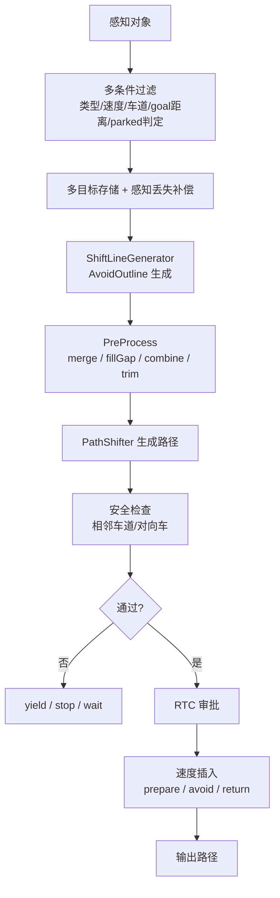
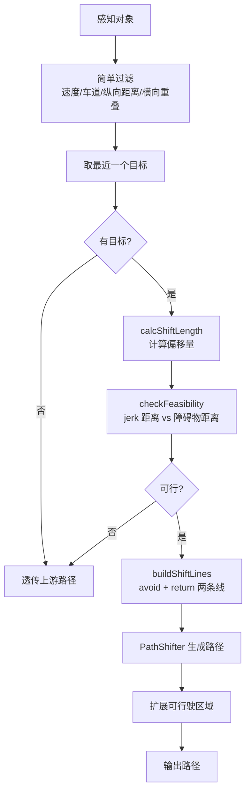

# Simple Avoidance 模块说明

本文档说明 `autoware_behavior_path_simple_avoidance_module`（以下简称 **Simple Avoidance**）的设计动机、与原版 `autoware_behavior_path_static_obstacle_avoidance_module`（以下简称 **Static Avoidance**）的差异，以及各改动的原因。

## 1. 模块定位

Simple Avoidance 是 BYD 为**封闭道路低速 AGV** 场景定制的精简绕障模块。它保留 Autoware behavior path planner 的核心能力——基于 `PathShifter` 生成横向偏移路径——但去掉了原版模块中大量面向开放道路、多目标、人机协同的复杂逻辑。

**当前默认配置**（`default_preset.yaml`）已启用 Simple Avoidance、关闭 Static Avoidance：

```yaml
launch_static_obstacle_avoidance: "false"
launch_simple_avoidance: "true"
```

两个模块**不应同时启用**，它们都占用 slot2 中的绕障位，功能重叠。

---

## 2. 总体对比

| 维度 | Static Avoidance（原版） | Simple Avoidance（本模块） |
|------|--------------------------|----------------------------|
| 代码规模 | ~8000 行（scene + utils + shift_line_generator + debug） | ~600 行（scene + utils + manager） |
| 参数数量 | 300+ 项（按对象类型、策略分组） | 11 项 |
| 目标处理 | 多目标，复杂过滤链 | **仅最近一个**静止目标 |
| 对象类型 | 按 PEDESTRIAN / CAR / TRUCK 等分别配置 | 不区分类型，统一处理 |
| 偏移线生成 | AvoidOutline → merge/trim/combine 多阶段 | 直接生成 avoid + return 两条 ShiftLine |
| RTC 审批 | 支持左右侧 RTC，ambiguous 车辆需人工批准 | **无 RTC**，`isExecutionReady()` 恒为 true |
| 安全检查 | 相邻车道来车、对向车、hysteresis | **无** |
| 速度规划 | insertPrepareVelocity / insertWaitPoint / insertStopPoint 等 | **不修改速度**，沿用上游路径速度 |
| 状态机 | avoid / yield / stop / wait-and-see | 仅 RUNNING → SUCCESS（偏移归零后退出） |
| 不可行时行为 | 插入等待点或停车点 | **透传**上游路径（passThrough） |
| 感知丢失补偿 | 有（compensateLostTargetObjects） | 无 |
| 适用场景 | 开放道路、多类型障碍物、需人机协同 | 封闭道路、低速 AGV、环境可预期 |

---

## 3. 算法流程对比

### 3.1 Static Avoidance 流程（简化）



### 3.2 Simple Avoidance 流程



核心差异：**Simple Avoidance 是一条直线流水线**，没有分支状态机，不可行就直接透传，不在路径上插停车/等待点。

---

## 4. 逐项改动说明

### 4.1 目标检测：从多目标复杂过滤到单目标最近优先

**原版**（`filterTargetObjects` 等）检查：

- 对象类型（行人/自行车/车辆/未知等分别配置）
- 是否静止、是否稳定（UNSTABLE_OBJECT）
- 是否在 ego 车道内/外
- 距 goal 距离（`object_check_goal_distance`，实测常导致 `TOO_NEAR_TO_GOAL`）
- parked vehicle 判定（`shiftable_ratio`、`th_offset_from_centerline`）
- ambiguous vehicle → wait-and-see 或 RTC 人工批准

**本模块**（`detectTarget()`）仅检查：

1. 速度 < `th_moving_speed`（默认 0.5 m/s）
2. 对象在当前 route lanelet 内
3. 纵向距离在 `[min_forward_distance, max_forward_distance]` 内
4. 横向与自车有重叠（`overlap < ego_half_width + lateral_margin` 才需要绕）
5. 多个满足条件时取**纵向最近**的一个

**为什么这样改：**

- 封闭道路 AGV 场景障碍物类型相对固定，无需按 CAR/TRUCK/UNKNOWN 分别调参
- 原版过滤链路过长，任一条件不满足即 `targets=0`，调试成本高（参见 `static_obstacle_avoidance_module/notes.md` 中的分层诊断）
- 单目标策略降低 PathShifter 多 shift line 合并/冲突的复杂度
- 去掉 goal 距离过滤，避免仿真中障碍物跟随 ego 前方时因距 goal 近而被误过滤

### 4.2 偏移量计算：从道路边界自适应到固定公式

**原版** `calcShiftLength()` 流程：

```
getAvoidMargin() → overhang_dist ± margin → max_left/right_shift_length 截断
```

需考虑路肩距离、hard/soft margin、对象类型 margin 等。

**本模块** `calcShiftLength()`：

```cpp
required_clearance = |lateral_offset| + object_half_width + ego_half_width + lateral_margin
shift_length = -required_clearance  // 障碍物在右侧
            或 +required_clearance  // 障碍物在左侧
```

超出 `max_shift_length` 时判定为 `NO_ROOM`。

**为什么这样改：**

- AGV 车道宽度固定、路肩余量可预期，用固定 lateral_margin 比动态 margin 更易调参
- 原版 `getAvoidMargin()` 的 `min(soft_lateral_distance_limit, max_avoid_margin)` 会限制偏移上限，在需要更大偏移时反而绕不过去

### 4.3 偏移线生成：去掉 ShiftLineGenerator 多阶段处理

**原版** 经 `ShiftLineGenerator` 生成 AvoidOutline（al_avoid + al_return），再经：

- `applyMergeProcess` — 相邻 outline 合并
- `applyFillGapProcess` — 填补时序空隙
- `applyCombineProcess` — 与已注册线去重
- `applyTrimProcess` — 小偏移过滤、量化、去噪
- `addReturnShiftLine` — 条件性追加回正线
- `findNewShiftLine` — 提取 RTC 待审批的新线

**本模块** `buildShiftLines()` 直接构造两条 ShiftLine：

| 线段 | 起点纵向 | 终点纵向 | 偏移变化 |
|------|----------|----------|----------|
| avoid | ego + min_prepare_distance | avoid_start + jerk距离 | 当前偏移 → shift_length |
| return | 障碍物后沿 + return_distance_after_object | return_start + jerk距离 | shift_length → 0 |

**为什么这样改：**

- 单目标场景不需要 merge/combine/trim
- 原版 return shift 常因 `no_enough_distance`、`object_near_goal` 等被跳过，导致绕障后无法回正
- 直接两条线，行为可预测，便于仿真验证

### 4.4 目标保持与退出条件：保留 Static 的核心状态机思想

**原版 Static Avoidance** 在仍有目标、ego 处于 shift line、或 `PathShifter` base offset 未回零时保持 RUNNING。

**本模块** 不引入完整 stored object / RTC 体系，但保留核心行为：

- 目标一旦锁定，优先按 UUID 刷新
- shifted path 导致 overlap 短暂变成 no-overlap 时，目标最多保持 `target_lost_time_threshold`
- 已锁定目标使用 `target_hold_lateral_hysteresis`，避免阈值附近反复进入/退出
- 只有 active target 已通过、shift line 清空、base offset 和 ego shift 都小于 `lateral_execution_threshold` 后，模块才允许 SUCCESS

这样可避免“刚生成避障路径，但 ego 还没开始横移，模块就 SUCCESS/DELETE”的问题。

### 4.5 可行性检查：只保留纵向 jerk 约束

**原版** 检查：横向 jerk/accel 限制、comfortable 路径、可行驶区域边界、同向/对向冲突等。

**本模块** `checkFeasibility()` 仅验证：

```
dist_to_shift_end = min_prepare_distance + max(jerk_distance, min_shifting_distance)
dist_to_obstacle  = target.longitudinal - object_half_length - lateral_margin

若 dist_to_shift_end > dist_to_obstacle → INSUFFICIENT_DISTANCE
```

**为什么这样改：**

- 低速 AGV 横向 jerk 约束宽松，纵向空间是主要瓶颈
- 原版 `comfortable=0` 是常见卡点（见 troubleshooting_zh.md），多由 lateral_accel/jerk 限制导致

### 4.6 去掉 RTC（Request To Cooperate）

**原版：**

- 左右绕障分别注册 RTC 状态
- ambiguous vehicle 默认 `policy=manual`，需操作员批准
- `isExecutionReady()` 依赖 RTC 激活状态
- 仿真中常出现 `request_op=1` 导致车辆停车等待

**本模块：**

- `isExecutionReady()` 恒返回 `true`
- `scene_module_manager.param.yaml` 中 `enable_rtc: false`
- 检测到目标且路径可行即直接执行

**为什么这样改：**

- 封闭道路 AGV 无需人机协同审批
- 消除仿真/实车调试中 RTC 未批准导致的不动问题

### 4.7 去掉安全检查和复杂状态机

**原版** `fillEgoStatus()` / `updateEgoBehavior()` 状态机：

| 状态 | 行为 |
|------|------|
| safe_path | 正常执行 |
| unsafe_yield_maneuver | 不安全，切 yield/停车 |
| unsafe_cancel_approved | 取消已批准路径 |
| force_deactivated | RTC 强制停用 |
| output_path_locked | 外部锁定 |

还会在路径上插入 `insertWaitPoint()`、`insertStopPoint()`、`insertPrepareVelocity()` 等。

**本模块：**

- 无安全检查
- 不可行时 `passThrough()` 返回上游路径，仅打 WARN 日志
- 不插入停车/等待/减速点

**为什么这样改：**

- 封闭道路无对向/相邻车道来车，安全检查收益低
- 原版 yield/stop 与下游 `obstacle_stop` 叠加，难以区分停车原因
- 停车逻辑交给 behavior velocity planner（如 obstacle_stop）统一处理，绕障模块只负责"能不能绕、怎么绕"

### 4.8 不修改路径速度

**原版** 在 `updateEgoBehavior()` 中按阶段写入速度：

- `insertPrepareVelocity()` — 绕障前减速
- `insertAvoidanceVelocity()` — 偏移中加速度限制
- `insertReturnDeadLine()` — 回正截止点前减速

**本模块** 只输出偏移后的几何路径，速度完全来自上游 lane following / motion planning。

**为什么这样改：**

- AGV 低速运行，上游已有速度规划
- 避免绕障模块与 motion planner 速度冲突
- 减少调参维度

### 4.9 参数精简

**本模块全部参数**（`simple_avoidance.param.yaml`）：

| 参数 | 默认值 | 含义 |
|------|--------|------|
| `th_moving_speed` | 0.5 | 超过此速度视为运动对象，忽略 |
| `min_forward_distance` | 0.5 | 最近检测距离 [m] |
| `max_forward_distance` | 60.0 | 最远检测距离 [m] |
| `lateral_margin` | 0.4 | 自车与障碍物之间的横向安全距离 [m] |
| `max_shift_length` | 4.0 | 最大横向偏移 [m] |
| `min_prepare_distance` | 5.0 | 开始侧移前的前向准备距离 [m] |
| `min_shifting_distance` | 10.0 | 侧移阶段最小纵向距离 [m] |
| `shifting_lateral_jerk` | 0.5 | 侧移横向 jerk 限制 [m/s³] |
| `min_shifting_speed` | 1.0 | 计算 jerk 距离时的最低假设速度 [m/s] |
| `return_distance_after_object` | 5.0 | 过障碍物后多远开始回正 [m] |
| `target_lost_time_threshold` | 1.0 | 已锁定目标短暂丢失时的保持时间 [s] |
| `target_hold_lateral_hysteresis` | 0.3 | 已锁定目标 overlap 判断的横向迟滞 [m] |
| `lateral_execution_threshold` | 0.05 | 判断 base offset / ego shift 已回零的阈值 [m] |
| `publish_debug_marker` | true | 是否发布 shift line 调试 marker |

**与原版关键参数对照：**

| 原版参数 | 本模块对应 | 说明 |
|----------|-----------|------|
| `avoidance.target_filtering.object_check_goal_distance` | 无 | 已移除，不再因距 goal 近而过滤 |
| `avoidance.target_filtering.max_forward_distance` | `max_forward_distance` | 直接对应 |
| `avoidance.target_filtering.parked_vehicle.th_offset_from_centerline` | 无 | 不再区分 parked/ambiguous |
| `avoidance.lateral_margin` | `lateral_margin` | 简化为单一值 |
| `avoidance.max_left/right_shift_length` | `max_shift_length` | 合并为单一上限 |
| `avoidance.return_dead_line` 等 | `return_distance_after_object` | 简化为固定后向距离 |
| `avoidance.request_approval` / RTC 相关 | 无 | 完全移除 |

---

## 5. 模块集成

### 5.1 启用方式

在 preset 中设置：

```yaml
launch_static_obstacle_avoidance: "false"
launch_simple_avoidance: "true"
```

模块注册名：`simple_avoidance`，位于 `scene_module_manager.param.yaml` 的 slot2。

### 5.2 日志命名空间

```text
planning.scenario_planning.lane_driving.behavior_planning.behavior_path_planner.simple_avoidance
```

### 5.3 调试

```bash
# 查看绕障日志（WARN 节流 1s）
grep 'SIMPLE_AVOIDANCE' your.log

# pass-through 原因
# no_target / infeasible_no_room / infeasible_distance / path_generation_failed

# 成功绕障
# [SIMPLE_AVOIDANCE] avoidance path generated shift=... target_lon=... target_lat=...

# debug marker（需 publish_debug_marker: true）
ros2 topic echo /planning/scenario_planning/lane_driving/behavior_planning/behavior_path_planner/debug/simple_avoidance --once
```

### 5.4 编译

```bash
cd /home/byd/autoware
colcon build --packages-select autoware_behavior_path_simple_avoidance_module \
  --cmake-args -DCMAKE_BUILD_TYPE=RelWithDebInfo
```

---

## 6. 适用场景与局限

### 6.1 适用

- 封闭园区 / 工厂 / 仓库等**固定路线**低速 AGV
- 障碍物为**静止**物体，且一次只需绕**一个**
- 不需要 RTC 人工审批
- 希望**快速调通**绕障链路、减少参数维度

### 6.2 不适用（应切回 Static Avoidance）

- 开放道路，需检查相邻车道来车、对向车
- 多个障碍物需同时规划（同向排列、反方向等）
- 需区分对象类型（行人 vs 车辆不同策略）
- 需 wait-and-see（观察 merging/deviating 车辆）
- 需 RTC 人工确认后再绕障
- 需绕障模块自身插入减速/停车点

### 6.3 已知局限

1. **单目标**：前方有两个障碍物时只绕最近的一个
2. **无安全兜底**：不检查侧方来车，依赖封闭场景假设
3. **不可行时只透传**：不会主动停车，需下游 obstacle_stop 等模块兜底
4. **无感知丢失补偿**：对象短暂消失可能导致 shift line 中断
5. **无对象类型过滤**：动态行人/车辆若速度低于阈值可能被误当作绕障目标

---

## 7. 排障速查

| 现象 | 可能原因 | 建议 |
|------|----------|------|
| 日志 `pass-through reason=no_target` | 无满足条件的障碍物 | 查速度阈值、纵向距离、横向 overlap |
| `infeasible_no_room` | 所需偏移超过 max_shift_length | 增大 `max_shift_length` 或 `lateral_margin` |
| `infeasible_distance` | 准备距离不够完成侧移 | 减小 `min_prepare_distance` 或增大障碍物前距离 |
| 已生成绕障路径后又变 no_overlap | shifted path 改变了目标相对横向距离 | 已锁定目标会按 UUID 保持，检查 `target_lost_time_threshold` 和日志 |
| 绕障后不回正 | return shift 未执行完即丢失目标 | 检查 `return_distance_after_object`；模块会在 shift 未完成时继续生成 |
| 有路径但车仍停 | 下游 obstacle_stop 触发 | 非本模块问题，查 behavior velocity planner |
| 绕错方向 | 障碍物 lateral_offset 符号 | 正 offset → 左移绕障，负 offset → 右移绕障 |

---

## 8. 文件结构

```
autoware_behavior_path_simple_avoidance_module/
├── config/simple_avoidance.param.yaml   # 参数
├── include/.../
│   ├── scene.hpp                        # 模块主类
│   ├── manager.hpp                      # 插件管理器
│   ├── data_structs.hpp                 # 参数/目标/调试数据结构
│   └── utils.hpp
├── src/
│   ├── scene.cpp                        # 核心逻辑（detectTarget/plan/buildShiftLines）
│   ├── manager.cpp                      # 参数加载
│   └── utils.cpp                        # setOrientation/getClosestShiftLength
├── plugins.xml
└── README_zh.md                         # 本文档
```

---

## 9. 总结

Simple Avoidance 不是对 Static Avoidance 的功能增强，而是面向**封闭道路低速 AGV** 的**有意简化**：

- **去掉**了导致仿真/调试频繁卡住的多目标过滤、RTC 审批、安全检查、状态机、速度插入
- **保留**了 PathShifter 横向偏移路径生成的核心能力
- **用** 11 个参数和 ~600 行代码换取可预测、易调试的绕障行为

如果后续场景扩展到开放道路或多障碍物，应切回 `autoware_behavior_path_static_obstacle_avoidance_module`，并参考其 `README.md`、`notes.md`、`troubleshooting_zh.md` 进行调参。
