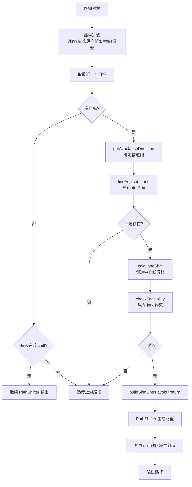

# Simple Lane Change Avoidance 模块说明

本文档说明 `autoware_behavior_path_simple_lane_change_avoidance_module`（以下简称 **Simple LC Avoidance**）的设计动机、与相关绕障模块的差异，以及集成与调参方法。

## 1. 模块定位

Simple LC Avoidance 是 BYD 为**封闭道路低速 AGV** 场景定制的**借道绕障**模块。当本车道内横向偏移空间不足、但 route 上存在可用相邻车道时，通过变道到邻道完成绕障，绕过后再回到原车道。

与 [`autoware_behavior_path_simple_avoidance_module`](../autoware_behavior_path_simple_avoidance_module/README_zh.md)（**Simple Avoidance**，车道内 PathShifter 偏移）互补：

| 策略 | 适用条件 |
|------|----------|
| Simple Avoidance | 本车道宽度足够，横向偏移即可避开障碍物 |
| Simple LC Avoidance（本模块） | 本车道不够宽，需借相邻 route 车道 |

**slot2 绕障位冲突**：`simple_avoidance`、`simple_lane_change_avoidance`、`static_obstacle_avoidance`、`avoidance_by_lane_change` 等均注册在 slot2，**同一时刻建议只启用一种绕障策略**，避免多模块竞争。

当前 `default_preset.yaml` 中 `launch_simple_avoidance` 与 `launch_simple_lc_avoidance` 默认均为 `true`，若仅需一种策略，请显式关闭另一个：

```yaml
launch_simple_avoidance: "false"
launch_simple_lc_avoidance: "true"
```

---

## 2. 总体对比

| 维度 | Static Avoidance | Avoidance By Lane Change | Simple Avoidance | Simple LC Avoidance（本模块） |
|------|------------------|--------------------------|------------------|-------------------------------|
| 绕障方式 | 车道内偏移 | 完整变道模块 | 车道内偏移 | **借邻道 + 回原道** |
| 代码规模 | ~8000 行 | ~数千行（含 LC 模块） | ~600 行 | ~550 行 |
| 参数数量 | 300+ | 大量 | 11 项 | **10 项** |
| 偏移量来源 | margin + 路肩自适应 | 变道几何 | 固定公式 + max_shift | **邻道中心线距离** |
| 邻道要求 | 无 | 有 | 无 | **必须有 route 邻道** |
| RTC / 安全检查 | 有 | 有 | 无 | **无** |
| 速度规划 | 有 | 有 | 无 | **无** |
| 不可行时 | 停车/等待 | 不变道 | 透传 | **透传** |

---

## 3. 算法流程



核心差异：**先选借道方向 → 查邻道 → 用邻道几何算偏移**，而非 Simple Avoidance 的固定 `required_clearance` 公式。

---

## 4. 关键逻辑说明

### 4.1 目标检测（`detectTarget()`）

与 Simple Avoidance 相同：

1. 速度 < `th_moving_speed`（默认 0.5 m/s）
2. 对象在当前 route lanelet 序列内
3. 纵向距离 ∈ `[min_forward_distance, max_forward_distance]`
4. 横向与自车有重叠（`overlap < ego_half_width + lateral_margin` 才需要绕）
5. 多个满足条件时取**纵向最近**的一个

### 4.2 借道方向（`getAvoidanceDirection()`）

`calcLateralOffset` 为正表示障碍物在路径**左侧**，为负表示在**右侧**。

| 障碍物位置 | lateral_offset | 借道方向 | 邻道查询 |
|------------|----------------|----------|----------|
| 左侧 | ≥ 0 | `RIGHT` | `getRightLanelet` |
| 右侧 | < 0 | `LEFT` | `getLeftLanelet` |

逻辑与 `avoidance_by_lane_change_module` 一致：障碍物在左 → 向右借道；在右 → 向左借道。

### 4.3 邻道查找（`findAdjacentLane()`）

1. 用 `getClosestLaneletWithinRoute(ego_pose)` 获取 ego 当前 lanelet（非 lanelet 序列首段）
2. 按方向查左/右邻道
3. 邻道必须在 route 上（`isRouteLanelet`）
4. 获取邻道 lanelet 序列供偏移与可行驶区域扩展

### 4.4 偏移量计算（`calcLaneShift()`）

```cpp
raw_shift = adjacent_arc.distance - current_arc.distance
shift_length = applyLaneShiftMargin(raw_shift, lateral_margin)
```

- 偏移量由**当前车道与目标邻道中心线**的横向距离决定
- 无 `max_shift_length` 上限（由地图车道几何隐含限制）
- `|shift_length| < 0.1 m` 时判定 `NO_ADJACENT_LANE`

### 4.5 可行性检查（`checkFeasibility()`）

仅验证纵向 jerk 约束（与 Simple Avoidance 相同形式）：

```
dist_to_shift_end = min_prepare_distance + max(jerk_distance, min_shifting_distance)
dist_to_obstacle  = target_lon - object_half_length - lateral_margin

若 dist_to_shift_end > dist_to_obstacle → INSUFFICIENT_DISTANCE
```

注：`lateral_margin` 同时用作纵向障碍物前缓冲，调参时需注意对纵向/横向的联动影响。

### 4.6 Shift line 与可行驶区域

- **avoid + return** 两条 ShiftLine，时序与 Simple Avoidance 相同
- `adjustDrivableArea()` 通过 `generateDrivableLanesWithAdjacent()` 将邻道并入可行驶区域，供下游规划与 obstacle_stop 使用

### 4.7 状态与退出

- 初始状态：`RUNNING`，`isExecutionReady()` 恒为 `true`（无 RTC）
- 目标丢失但 shift 未完成：继续输出 PathShifter 残留路径（回正阶段）
- `canTransitSuccessState()`：无目标且 `|current_shift| < 0.05` → `SUCCESS`

---

## 5. 参数说明

配置文件：[`config/simple_lc_avoidance.param.yaml`](config/simple_lc_avoidance.param.yaml)

| 参数 | 默认值 | 含义 |
|------|--------|------|
| `th_moving_speed` | 0.5 | 超过此速度视为运动对象，忽略 [m/s] |
| `min_forward_distance` | 1.0 | 最近检测距离 [m] |
| `max_forward_distance` | 50.0 | 最远检测距离 [m] |
| `lateral_margin` | 0.3 | 借道额外横向余量；兼作纵向障碍物前缓冲 [m] |
| `min_prepare_distance` | 3.0 | 开始侧移前的前向准备距离 [m] |
| `min_shifting_distance` | 5.0 | 侧移阶段最小纵向距离 [m] |
| `shifting_lateral_jerk` | 0.2 | 侧移横向 jerk 限制 [m/s³] |
| `min_shifting_speed` | 1.0 | 计算 jerk 距离时的最低假设速度 [m/s] |
| `return_distance_after_object` | 5.0 | 过障碍物后多远开始回正 [m] |
| `publish_debug_marker` | true | 是否发布 shift line 调试 marker |

与 Simple Avoidance 的主要参数差异：无 `max_shift_length`（由邻道几何决定）；`lateral_margin` 默认更小（0.3 vs 0.8）。

---

## 6. 模块集成

### 6.1 启用方式

在 preset 中设置（二选一或按场景切换）：

```yaml
launch_static_obstacle_avoidance: "false"
launch_simple_avoidance: "false"
launch_simple_lc_avoidance: "true"
```

模块注册名：`simple_lane_change_avoidance`，位于 `scene_module_manager.param.yaml` 的 slot2。

Launch 参数路径：

```text
behavior_path_config_path/simple_lc_avoidance/simple_lc_avoidance.param.yaml
```

### 6.2 日志命名空间

```text
planning.scenario_planning.lane_driving.behavior_planning.behavior_path_planner.simple_lane_change_avoidance
```

### 6.3 调试

```bash
# 查看绕障日志
grep 'SIMPLE_LC_AVOIDANCE' your.log

# pass-through 原因
# no_target / no_adjacent_lane / infeasible_distance / path_generation_failed

# 成功借道绕障（direction=left 表示借左邻道，right 表示借右邻道）
# [SIMPLE_LC_AVOIDANCE] lane change path generated shift=... direction=right target_lon=... target_lat=...

# debug marker（需 publish_debug_marker: true）
ros2 topic echo /planning/scenario_planning/lane_driving/behavior_planning/behavior_path_planner/debug/simple_lane_change_avoidance --once
```

### 6.4 编译与测试

```bash
cd /home/byd/autoware
colcon build --packages-select autoware_behavior_path_simple_lane_change_avoidance_module \
  --cmake-args -DCMAKE_BUILD_TYPE=RelWithDebInfo -DBUILD_TESTING=ON

colcon test --packages-select autoware_behavior_path_simple_lane_change_avoidance_module
```

单元测试覆盖：`getAvoidanceDirection`、`applyLaneShiftMargin`、`checkFeasibility` 边界条件（见 `test/test_utils.cpp`）。

---

## 7. 适用场景与局限

### 7.1 适用

- 封闭园区 / 工厂 / 仓库等**多车道固定路线**低速 AGV
- 本车道宽度不足以车道内绕障，但**相邻车道在 route 上且可借道**
- 障碍物为**静止**物体，一次只需绕**一个**
- 不需要 RTC 人工审批

### 7.2 不适用

- **单车道**或无邻道的 route（应使用 Simple Avoidance 或 Static Avoidance）
- 开放道路需检查邻道来车、对向车（应使用 `avoidance_by_lane_change` 或 Static Avoidance）
- 多障碍物需同时规划
- 需绕障模块自身插入减速/停车点

### 7.3 已知局限

1. **单目标**：前方多个障碍物时只处理最近的一个
2. **无安全兜底**：不检查邻道来车，依赖封闭场景假设
3. **不可行时只透传**：不主动停车，需下游 `obstacle_stop` 等兜底
4. **无感知丢失补偿**：目标消失后依赖 PathShifter 残留 shift 完成回正
5. **无绕障余量校验**：不验证邻道偏移是否足以避开障碍物包围盒，假设借到邻道中心即足够
6. **无对象类型过滤**：低速动态对象可能被误检

---

## 8. 排障速查

| 现象 | 可能原因 | 建议 |
|------|----------|------|
| `pass-through reason=no_target` | 无满足条件的障碍物 | 查速度阈值、纵向距离、横向 overlap |
| `pass-through reason=no_adjacent_lane` | 无邻道或邻道不在 route 上 | 检查地图拓扑与 route 是否包含借道车道 |
| `infeasible_distance` | 障碍物过近，纵向空间不够完成侧移 | 减小 `min_prepare_distance` 或增大障碍物前距离 |
| `path_generation_failed` | shift line 区间过短或索引异常 | 查参考路径长度与障碍物距离 |
| 借错方向 | `lateral_offset` 符号或方向映射 | 正 offset（障碍物在左）应 `direction=right` |
| 绕障后不回正 | return shift 未完成即丢失目标 | 模块会继续 shift；检查 `return_distance_after_object` |
| 有路径但车仍停 | 下游 obstacle_stop 触发 | 查 behavior velocity planner |
| 与 Simple Avoidance 行为冲突 | slot2 多模块同时启用 | preset 中只保留一种绕障模块 |

---

## 9. 文件结构

```
autoware_behavior_path_simple_lane_change_avoidance_module/
├── config/simple_lc_avoidance.param.yaml   # 参数
├── include/.../
│   ├── scene.hpp                           # 模块主类
│   ├── manager.hpp                         # 插件管理器
│   ├── data_structs.hpp                    # 参数/目标/邻道数据结构
│   └── utils.hpp                           # 方向/可行性/偏移工具函数
├── src/
│   ├── scene.cpp                           # detectTarget/calcLaneShift/plan
│   ├── manager.cpp                         # 参数加载
│   └── utils.cpp                           # getAvoidanceDirection/checkFeasibility 等
├── test/test_utils.cpp                     # 单元测试
├── plugins.xml
└── README_zh.md                            # 本文档
```

---

## 10. 总结

Simple LC Avoidance 面向**有多车道 route 的封闭 AGV 场景**，在 Simple Avoidance（车道内偏移）不够用时提供**借道绕障**能力：

- **保留** PathShifter 核心与精简单目标流水线
- **增加** 邻道查找、借道方向判定、可行驶区域邻道扩展
- **去掉** RTC、安全检查、状态机、速度插入

选型建议：

- 单车道或车道够宽 → **Simple Avoidance**
- 多车道且需借道 → **Simple LC Avoidance**（本模块）
- 开放道路 / 复杂交互 → **Static Avoidance** 或 **Avoidance By Lane Change**
